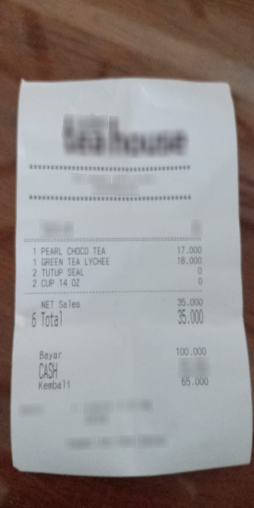

# Fine-tuning PaliGemma for Image-to-JSON Extraction with QLoRA

This project demonstrates how to fine-tune Google's PaliGemma (a powerful multimodal vision-language model) to extract structured JSON data from receipt images. We utilize QLoRA (Quantized Low-Rank Adaptation) and Supervised Fine-Tuning (SFT) techniques to efficiently adapt the model for this specific task.

## 💡 Before & After: The Power of Fine-tuning

<table width="100%">
  <tr>
    <th width="50%" align="center">Before Fine-tuning</th>
    <th width="50%" align="center">After Fine-tuning</th>
  </tr>
  <tr>
    <td width="50%" align="center"></td>
    <td width="50%" align="center"></td>
  </tr>
  <tr>
    <td width="50%"><b>Original Model Output:</b> "'receipt'"</td>
    <td width="50%"><b>Fine-tuned Model Output:</b> 
<pre>
{
  "menu": [
    {
      "nm": "PEARL CHOCO TEA",
      "cnt": "1",
      "price": "17.000"
    },
    {
      "nm": "GREEN TEA LYCHEE",
      "cnt": "1", 
      "price": "18.000"
    },
    {
      "nm": "TOFU SEA",
      "cnt": "2",
      "price": "0"
    },
    {
      "nm": "CAP KOK",
      "cnt": "2",
      "price": "0"
    }
  ],
  "sub_total": {
    "subtotal_price": "35.000"
  },
  "total": {
    "total_price": "35.000",
    "cashprice": "100.000",
    "changeprice": "65.000"
  }
}
</pre>
    </td>
  </tr>
</table>

> **Note:** The example above shows results from the basic model trained in the Foundation Tutorial. The Advanced Tutorial includes systematic ablation studies that yield even better performance with optimized hyperparameters.

This dramatic improvement transforms PaliGemma from a general image understanding model into a specialized tool for extracting structured data from receipts, all while requiring minimal computational resources.

## 📚 Notebook Overview

This project includes two comprehensive tutorials, each serving different learning objectives:

### 1. **Foundation Tutorial**: [`peft_paligemma_im2json_qlora_SFT.ipynb`](peft_paligemma_im2json_qlora_SFT.ipynb)
**Perfect for beginners and those new to multimodal fine-tuning**

This notebook covers the essential foundations of fine-tuning PaliGemma with clear explanations and step-by-step implementation:

- **Core Concepts**: Introduction to PaliGemma architecture, QLoRA methodology, and SFT approach
- **Dataset Setup**: Loading and analyzing the CORD v2 receipt dataset
- **Model Configuration**: Setting up quantization, LoRA adapters, and training parameters
- **Training Pipeline**: Complete training process with standard loss monitoring
- **Basic Evaluation**: Side-by-side comparison between original and fine-tuned models
- **Parameter Analysis**: Detailed explanations of hyperparameter choices and their impact

**Key Learning Outcome**: Understand how to successfully fine-tune a 3B parameter multimodal model on consumer hardware (16GB GPU) while achieving production-ready performance.

### 2. **Advanced Tutorial**: [`peft_paligemma_im2json_qlora_SFT_advanced.ipynb`](peft_paligemma_im2json_qlora_SFT_advanced.ipynb)
**For practitioners ready to deploy production-grade models**

This notebook provides a more advanced approach implementing custom metric calculation during fine-tuning, which is also key for ablation studies to choose optimal hyperparameters:

- **Custom Metrics During Training**: Real-time calculation of task-specific metrics (structure similarity, value accuracy, field F1, etc.) integrated directly into the training loop for immediate feedback
- **Hyperparameter Ablation Framework**: Systematic experiments using custom metrics to objectively compare LoRA rank, alpha scaling, dropout, and learning rate configurations
- **Production-Grade Evaluation**: Memory-efficient implementation of complex metrics that scales to large models without causing OOM errors
- **Data-Driven Optimization**: Evidence-based approach using custom metrics to identify optimal configurations rather than relying on general heuristics
- **Performance Analysis**: Deep dive into training charts and metric interpretation from Weights & Biases to understand model behavior

**Key Learning Outcome**: Master the systematic experimentation and evaluation approaches needed to optimize models for production deployment through custom metrics and principled ablation studies.

## 🔗 Related Resources

**Want to understand PaliGemma architecture in depth?** Check out [**Implementing PaliGemma From Scratch**](https://github.com/veronikayurchuk/paligemma-from-scratch) - my PyTorch implementation of PaliGemma with enhanced and detailed visualizations.

This complementary project implements the model architecture from scratch, providing detailed explanations and visualizations for each component. Perfect for understanding the inner workings before diving into fine-tuning!

## 🚀 Getting Started

**New to multimodal fine-tuning?** Start with the [Foundation Tutorial](peft_paligemma_im2json_qlora_SFT.ipynb)

**Ready for production-grade techniques?** Jump to the [Advanced Tutorial](peft_paligemma_im2json_qlora_SFT_advanced.ipynb)

## Hardware Requirements

- **Minimum**: 16GB GPU memory (tested on L4, P100, V100)
- **Training Cost**: ~$0.88 on GCP L4 instance for complete training pipeline
- **Training Time**: ~50 minutes for 3 epochs on CORD dataset

## Implementation Highlights

- Model quantization with bitsandbytes (4-bit NF4)
- Parameter-efficient fine-tuning with PEFT 
- Advanced training pipeline with TRL's SFTTrainer
- Custom evaluation metrics for structured data extraction
- Systematic hyperparameter optimization with ablation studies
- Weights & Biases integration for experiment tracking
